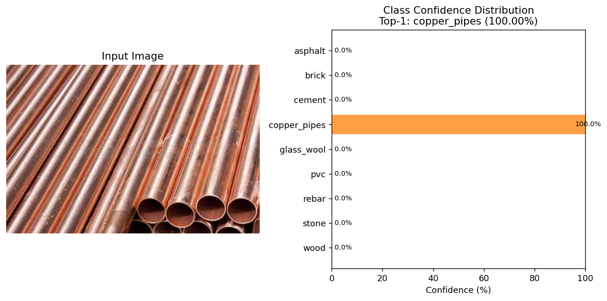
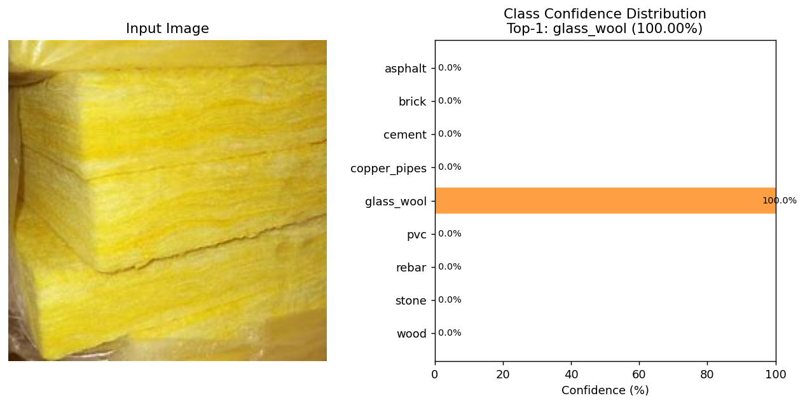
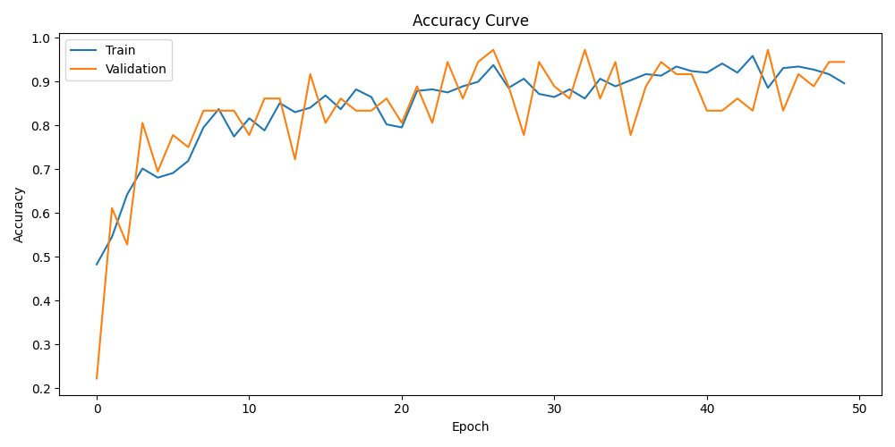
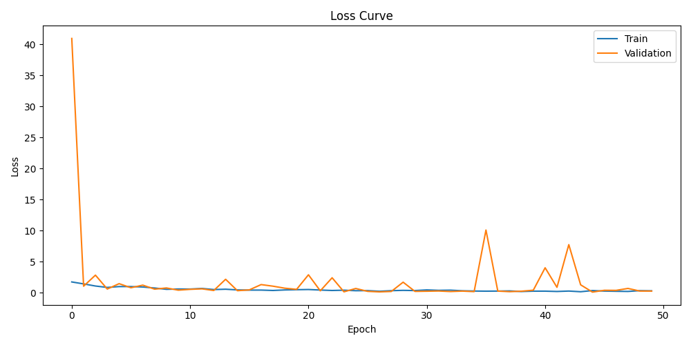
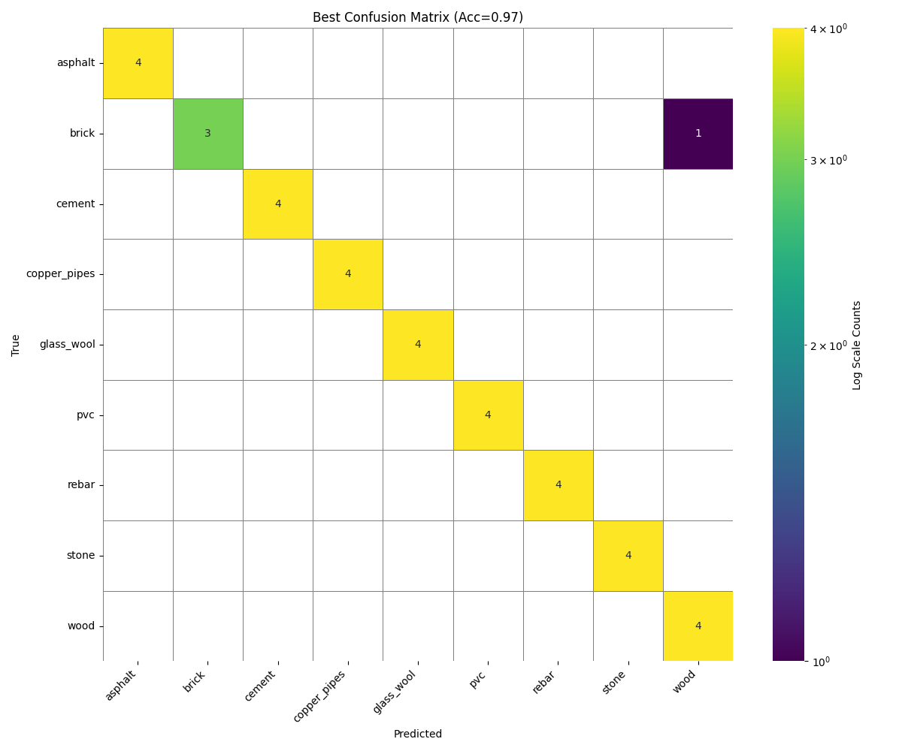
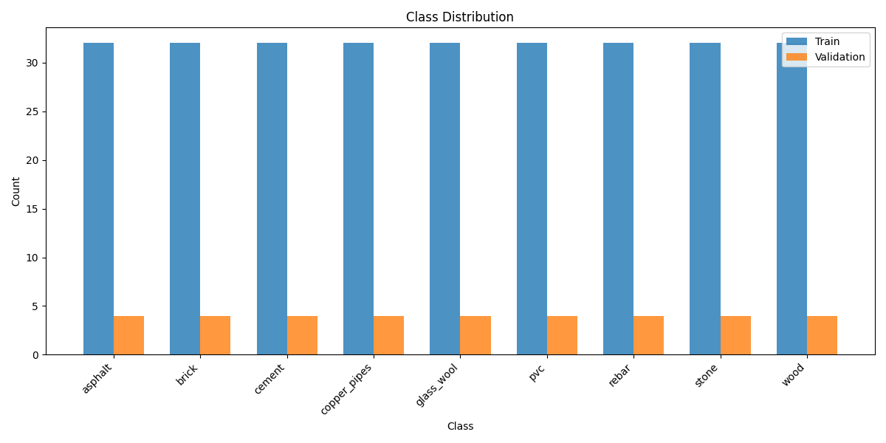

# 材料识别系统

> 基于 ResNet50 与 Django 的建筑材料图像识别与管理系统 —— 毕业设计项目

面向施工现场材料管理场景，使用迁移学习训练卷积神经网络实现 **9 类常见建筑材料的自动识别**，
并配套完整的 Web 管理系统：用户权限、识别日志、材料档案、错误反馈闭环与概率可视化。

<p>
  
  
  
  
</p>

---

## 目录

- [项目展示](#项目展示)
- [功能特性](#功能特性)
- [快速开始](#快速开始)
- [默认账号](#默认账号)
- [项目结构](#项目结构)
- [数据集与模型](#数据集与模型)
- [系统设计](#系统设计)
- [技术栈](#技术栈)
- [常见问题](#常见问题)
- [开发说明](#开发说明)

---

## 项目展示

项目介绍页（GitHub Pages）：**https://你的用户名.github.io/material-recognition-django/**

> **请注意**：GitHub Pages 只能托管静态文件，**无法运行 Django 服务与 PyTorch 推理**，
> 因此该页面是项目展示页而非在线 Demo。要实际使用识别功能，请按 [快速开始](#快速开始) 在本地启动。

### 识别效果

模型对真实样本的推理输出（左：输入图像；右：9 个类别的概率分布）：

| 铜管（copper_pipes）· 100.00% | 玻璃棉（glass_wool）· 100.00% |
| :---: | :---: |
|  |  |

### 模型训练结果

| 准确率曲线 | 损失曲线 |
| :---: | :---: |
|  |  |
| **混淆矩阵** | **类别分布** |
|  |  |

---

## 功能特性

| 模块 | 说明 |
| --- | --- |
| **材料图像识别** | 支持本地上传、浏览器摄像头实时拍摄、内置样例三种输入方式，输出材料类别与置信度 |
| **概率可视化** | 柱状图呈现全部类别概率分布，支持在线查看与导出 PNG |
| **材料档案管理** | 9 类材料的简介、产地、库存集中维护，识别结果自动关联档案展示 |
| **识别日志审计** | 完整记录每次识别与反馈，支持按用户、操作类型、材料、时间区间组合检索 |
| **错误反馈闭环** | 用户可标注正确类别，反馈记录与原识别结果关联保存，为模型迭代积累数据 |
| **用户与权限** | 管理员 / 普通用户两级权限，服务端强制校验；密码加密摘要存储；支持自助注册 |
| **数据导入** | 内置命令直接解析 MySQL 导出文件，无需安装数据库客户端即可完成数据迁移 |
| **批量识别** | 命令行批量处理图片文件夹并导出 CSV 结果，便于离线评估模型表现 |

---

## 快速开始

### 方式一：一键脚本（Windows 推荐）

双击项目根目录的 **`runserver.cmd`**，脚本会自动完成：

1. 创建虚拟环境 `.venv`
2. 安装依赖（首次约 250 MB，需等待几分钟）
3. 初始化数据库
4. 导入初始数据
5. 启动开发服务器

启动后用浏览器访问 <http://127.0.0.1:8000>。

### 方式二：手动执行

```bash
python -m venv .venv
.venv\Scripts\activate          # Linux / macOS: source .venv/bin/activate

pip install -r requirements.txt
python manage.py migrate
python manage.py import_legacy_data
python manage.py runserver
```

### 环境要求

- Python 3.9 ~ 3.11
- Windows / Linux / macOS
- 无 GPU 亦可运行（CPU 单张图片推理约 0.3 秒）

> **依赖版本提醒**：`torch 2.2.2` 是按 NumPy 1.x 编译的，必须搭配 `numpy<2`，
> 否则 `transforms.ToTensor()` 会失效并报 `Failed to initialize NumPy`。
> `requirements.txt` 中已锁定版本。

如需启用 GPU 推理：

```bash
pip install torch==2.2.2 torchvision==0.17.2 --index-url https://download.pytorch.org/whl/cu121
set MATERIAL_MODEL_DEVICE=cuda
```

---

## 默认账号

| 用户名 | 密码 | 权限 | 可访问功能 |
| --- | --- | --- | --- |
| `Admin` | `123456` | 管理员 | 全部功能（含日志审计与用户管理） |
| `aaa` | `123` | 普通用户 | 材料识别、材料管理 |
| `luo` | `456` | 普通用户 | 材料识别、材料管理 |

> 密码以 PBKDF2 加密摘要存储，数据库中不保存明文。
> **正式部署前请务必修改默认密码**，并设置 `DJANGO_SECRET_KEY` 环境变量。

---

## 项目结构

```
material_recognition_django/
├── manage.py
├── runserver.cmd                 # Windows 一键启动脚本
├── requirements.txt
├── config/                       # 项目配置
│   ├── settings.py               # 模型路径、类别、设备等配置集中在此
│   ├── urls.py
│   └── wsgi.py / asgi.py
├── recognition/                  # 业务应用
│   ├── models.py                 # Profile / LoginLog / IdentifyLog / Material
│   ├── forms.py                  # 登录、注册、识别、筛选、材料更新等表单
│   ├── views.py                  # 全部视图与权限控制
│   ├── ml.py                     # ★ 推理模块：模型加载、预测、概率图表
│   ├── urls.py
│   ├── admin.py
│   ├── utils.py
│   ├── management/commands/      # 自定义管理命令
│   │   ├── import_legacy_data.py # 解析 SQL 文件导入数据（可重复执行）
│   │   ├── predict_folder.py     # 批量识别并导出 CSV
│   │   └── check_model.py        # 环境与模型自检
│   ├── migrations/
│   └── templates/recognition/    # 页面模板
├── static/
│   ├── css/app.css               # 设计令牌集中在 :root
│   └── js/identify.js            # 上传预览与摄像头抓拍
├── models/                       # 模型权重放置目录（见该目录 README）
├── sample_images/                # 示例图片目录（可选）
├── docs/                         # GitHub Pages 展示页
├── tools/
│   ├── smoke_test.py             # 端到端冒烟测试（61 项断言）
│   ├── verify_setup.py           # 环境自检脚本
│   └── make_docs_assets.py       # 生成展示页图片素材
└── media/                        # 用户上传的图片
```

---

## 数据集与模型

### 数据集

9 类建筑材料，每类 40 张，共 **360 张**，按 8 : 1 : 1 划分为训练集 / 验证集 / 测试集：

| 类别 | 英文标签 | 训练 | 验证 | 测试 |
| --- | --- | :---: | :---: | :---: |
| 沥青 | `asphalt` | 32 | 4 | 4 |
| 砖 | `brick` | 32 | 4 | 4 |
| 水泥 | `cement` | 32 | 4 | 4 |
| 铜管 | `copper_pipes` | 32 | 4 | 4 |
| 玻璃棉 | `glass_wool` | 32 | 4 | 4 |
| PVC | `pvc` | 32 | 4 | 4 |
| 钢筋 | `rebar` | 32 | 4 | 4 |
| 石材 | `stone` | 32 | 4 | 4 |
| 木材 | `wood` | 32 | 4 | 4 |

### 训练配置

| 项目 | 设置 |
| --- | --- |
| 骨干网络 | ResNet50（ImageNet 预训练权重迁移学习） |
| 输入尺寸 | 224 × 224（先缩放至 256 再中心裁剪） |
| 归一化 | mean `[0.485, 0.456, 0.406]`，std `[0.229, 0.224, 0.225]` |
| 优化器 | AdamW，学习率 1e-3，权重衰减 1e-4 |
| 损失函数 | CrossEntropyLoss |
| 批量大小 | 16 |
| 训练轮数 | 50 |
| 数据增强 | RandomResizedCrop(224) + RandomHorizontalFlip |
| 随机种子 | 42 |

### 获取模型权重

训练好的权重 `best_model.pth`（约 90 MB）**未纳入 Git 仓库**，请从本仓库
**Releases** 页面下载后放入 `models/` 目录：

```
material_recognition_django/
└── models/
    └── best_model.pth
```

程序按以下顺序自动查找权重，找到即用：

1. 环境变量 `MATERIAL_MODEL_PATH`
2. `models/best_model.pth`
3. 同级目录 `pytorch_model/best_model.pth`

放置完成后执行自检确认：

```bash
python manage.py check_model
```

---

## 系统设计

### 系统架构

```
┌─────────────────────────────────────────────────┐
│  表现层（浏览器）                                │
│  识别页面 · 材料管理 · 日志查询 · 用户管理        │
└───────────────────────┬─────────────────────────┘
                        │ HTTP
┌───────────────────────▼─────────────────────────┐
│  业务层（Django）                                │
│  URL 路由 → 视图 View → 表单校验 → 权限控制       │
│                    ↓                            │
│              模板渲染 / JSON 响应                │
└───────────────────────┬─────────────────────────┘
                        │
┌───────────────────────▼─────────────────────────┐
│  算法层                    │  数据层             │
│  ResNet50 推理             │  ORM 模型           │
│  图像预处理                │  SQLite / MySQL     │
│  Matplotlib 概率图表       │  媒体文件存储        │
└───────────────────────────┴─────────────────────┘
```

### 数据模型

| 模型 | 说明 | 关键字段 |
| --- | --- | --- |
| `auth.User` + `Profile` | 用户与权限 | `username`、`permission`（admin / user） |
| `IdentifyLog` | 识别与反馈日志 | `username`、`action`、`datetime`、`material_name`、`confidence`、`confidences` |
| `LoginLog` | 登录日志 | `username`、`action`、`datetime` |
| `Material` | 材料档案 | `material_id`、`name`、`info`、`location`、`count` |

### URL 路由

| URL | 功能 | 权限 |
| --- | --- | --- |
| `/login/` `/logout/` `/register/` | 登录 / 登出 / 注册 | 公开 |
| `/identify/` | 材料识别 | 登录用户 |
| `/identify/result/<id>/` | 识别结果 | 登录用户 |
| `/identify/graph/<id>/` | 概率详情页 | 登录用户 |
| `/identify/graph/<id>.png` | 概率分布图（PNG） | 登录用户 |
| `/identify/feedback/<id>/` | 反馈识别错误 | 登录用户 |
| `/materials/` `/materials/update/` | 材料档案 / 修改 | 登录用户 |
| `/logs/` `/logs/logins/` | 识别日志 / 用户日志 | 管理员 |
| `/users/` `/users/add/` `/users/delete/` | 用户管理 | 管理员 |
| `/admin/` | Django 后台 | 超级用户 |

### 管理命令

```bash
# 环境与模型自检（可指定图片做一次真实推理）
python manage.py check_model --image path/to/test.jpg

# 批量识别文件夹并导出 CSV，可选写入日志
python manage.py predict_folder path/to/folder --out predictions.csv --write-log

# 从 SQL 文件导入数据（可重复执行，自动判重）
python manage.py import_legacy_data --flush --dry-run
```

---

## 技术栈

| 层次 | 技术 |
| --- | --- |
| 深度学习 | PyTorch 2.2.2、torchvision 0.17.2、ResNet50 |
| Web 框架 | Django 4.2 LTS |
| 数据库 | SQLite（默认）/ MySQL |
| 图像处理 | Pillow |
| 图表绘制 | Matplotlib |
| 前端 | 原生 HTML / CSS / JavaScript（无外部 CDN 依赖） |
| 部署 | WSGI（waitress / gunicorn） |

---

## 常见问题

**Q：启动脚本双击后窗口一闪而过？**
在项目目录按住 Shift 右键 →「在此处打开 PowerShell 窗口」，输入 `runserver.cmd` 回车，
错误信息会保留在窗口里。

**Q：识别时提示"模型文件不存在"？**
权重未放置。请从 Releases 下载 `best_model.pth` 放入 `models/` 目录，
或用 `MATERIAL_MODEL_PATH` 环境变量指定路径。

**Q：摄像头打不开？**
浏览器要求安全上下文，仅在 `localhost` 或 HTTPS 下允许调用摄像头。
用局域网 IP 访问时会被浏览器拒绝。

**Q：示例图片下拉框是空的？**
把图片按 `sample_images/<类别名>/xxx.jpg` 放好即可，类别名需与
`config/settings.py` 中的 `MATERIAL_CLASS_NAMES` 一致。目录为空时该选项会自动禁用，
不影响上传与摄像头识别。

**Q：图表页第一次打开很慢？**
Matplotlib 首次导入需要约 1~2 秒，之后会走缓存。

**Q：如何切换到 MySQL？**
编辑 `config/settings.py`，注释 SQLite 配置、启用下方 MySQL 配置，
然后 `pip install mysqlclient` 并重新执行 `migrate`。

---

## 开发说明

### 测试

```bash
# 启动服务（另开一个终端）
python manage.py runserver 8011

# 端到端冒烟测试：61 项断言
python tools/smoke_test.py http://127.0.0.1:8011
```

覆盖范围：登录登出、上传识别、示例图片识别、连续换图识别（回归）、摄像头 dataURL 识别、
概率图表 PNG、错误反馈、四类管理页面、普通用户越权拦截、路径穿越拦截、伪装图片拦截、
注册与密码强度校验、删除用户的保护规则等。

### 环境变量

| 变量 | 默认值 | 说明 |
| --- | --- | --- |
| `DJANGO_SECRET_KEY` | 开发用固定值 | **正式部署必须设置** |
| `DJANGO_DEBUG` | `True` | 正式部署设为 `False` |
| `DJANGO_ALLOWED_HOSTS` | `127.0.0.1,localhost,[::1]` | 局域网访问时追加本机 IP |
| `MATERIAL_MODEL_PATH` | `models/best_model.pth` | 模型权重路径 |
| `MATERIAL_SAMPLE_DIR` | `sample_images/` | 示例图片目录 |
| `MATERIAL_MODEL_DEVICE` | `auto` | `auto` / `cpu` / `cuda` |
| `MATERIAL_SAMPLE_PER_CLASS` | `3` | 每类示例图片数量 |

### 安全设计

- 密码使用 PBKDF2 加密摘要存储，数据库中不保存明文
- 管理员功能在服务端强制校验，非管理员访问返回 404
- 所有表单启用 CSRF 保护
- 上传图片统一经 Pillow 校验并按 EXIF 摆正、限制尺寸后转存，不直接信任用户文件
- 示例图片路径经白名单校验，防止路径穿越
- 登录跳转地址经同源校验，防止开放重定向
- 删除用户时禁止删除当前账号与最后一个管理员

---

## 许可

本项目采用 MIT License 开源，仅供学习与研究使用。
